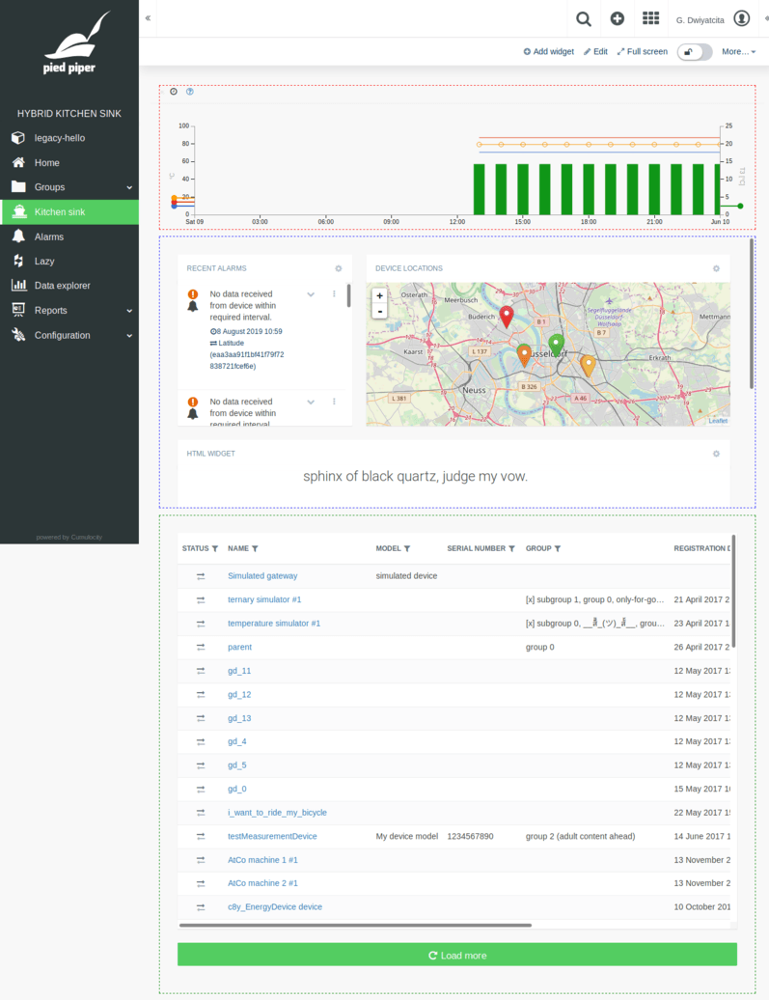

# cumulocity-hybrid-kitchen-sink

[](https://www.npmjs.com/package/cumulocity-hybrid-kitchen-sink)
[](http://npm-stat.com/charts.html?package=cumulocity-hybrid-kitchen-sink)
[](https://raw.githubusercontent.com/dwiyatci/cumulocity-hybrid-kitchen-sink/master/LICENSE.txt)

A Cumulocity hybrid "kitchen sink" app for showcasing the following:

- [x] extending default app (i.e. Cockpit).
- [x] creating a custom widget in Angular and using it side-by-side with existing widgets.
- [x] reusing some Cumulocity services and components from AJS (AngularJS) world by upgrading.
- [x] applying custom branding.
- [x] adding and loading custom language translations.
- [x] setting up unit testing infrastructure.



### Why?

**Good guy Glenn**: to venture to the virtue - you don't need a reason to help Earthlings. Just do something good, expect nothing in return. Rely on _serendipity_.

**Bad guy Glenn**: to kill my daily productivity killers as a programmer:

- corporate crap meetings,
- corporate crap emails,
- corporate crap interruptions,
- corporate crap customer calls,
- corporate crap support duties,
- corporate crap under qualified/not-willing-to-learn/annoying Earthlings,
- and other corporate craps in between.

What a jerk, you say? Yes, I'm being a jerk here. ¬‿¬

## Installation

- Make sure you have Node.js LTS installed and npm from its [website](https://nodejs.org), or better even, use [nvm](https://github.com/creationix/nvm).

- Install [yarn](https://yarnpkg.com/en/docs/install).

- Clone the repo, `cd` to your project directory.

- Set the `@c8y/*` packages released (UI build) version you want to develop against:

```bash
$ yarn use-c8y <@c8y_packages_version>
```

e.g.

```bash
$ yarn use-c8y 1005.1.0
```

- Install dependencies:

```bash
$ yarn install:clean
```

## Usage

- Read. The source.

  - Extending Cockpit: [index.ts](src/index.ts), [ng1.ts](src/ng1.ts).
  - Creating custom widget: [hello-widget](src/app/hello-widget).
  - Reusing/upgrading AJS services and components: [ajs](src/app/ajs), [sink](src/sink).
  - Applying custom branding: [branding](src/branding), [assets](src/assets), [package.json](src/package.json).
  - Adding and loading locales: [locales](src/locales), [c8ycli-extra-webpack.config.js](c8ycli-extra-webpack.config.js), [package.json](src/package.json).
  - Setting up testing infrastructure: [jest.config.js](jest.config.js), [testing](src/testing).

- Start your development server:

```bash
$ yarn start -u <your_tenant_url>
```

## Unit testing

```bash
$ yarn test
```

- watch mode:

```bash
$ yarn test --watch
```

## i18n and l10n

- Extract locales (l10n?):

```bash
$ yarn extract-locale
```

- Compile locales (i18n?):

```bash
$ yarn compile-locale
```

Output folder: `src/locales`.

## Build

```bash
$ yarn build
```

## Deploy

- interactive:

```bash
$ yarn deploy
```

- non-interactive:

```bash
$ yarn deploy -u <your_tenant_url> -T <your_tenant> -U <your_username> -P <your_username_password>
```

## TODO

- [ ] 🏞️ Integrate "ng1" unit testing infrastructure for legacy plugins (tremendously windy road ahead).

## Author

Glenn Dwiyatcita ([@dwiyatci](http://tiny.cc/dwiyatci))

## License

MIT.

See [LICENSE.txt](LICENSE.txt).
